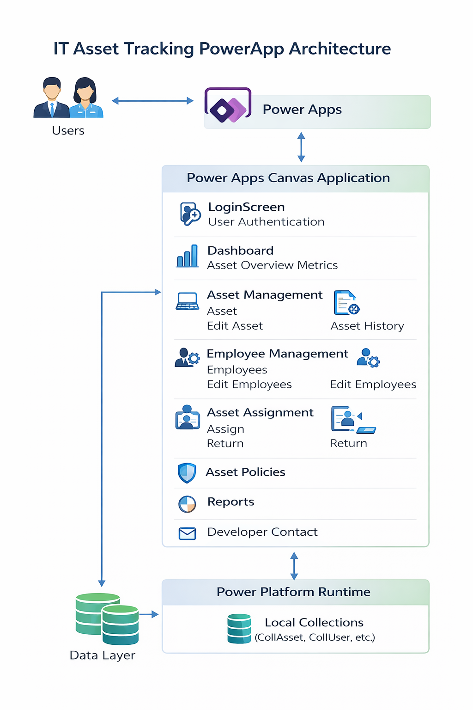

# IT Asset Tracker – Power Apps Project

## Overview

The **IT Asset Tracker** is a low-code application built using Microsoft Power Apps to manage and monitor organizational IT assets such as laptops, desktops, and other equipment.
The system allows administrators to track asset inventory, assign devices to employees, monitor asset status, and manage the asset lifecycle through an intuitive dashboard.

This project demonstrates how low-code tools can be used to build enterprise-ready asset management solutions quickly.

---

## Key Features

### Asset Management

* Maintain a centralized inventory of IT assets
* Store details such as asset type, category, model, and status
* Edit and update asset information easily

### Employee Management

* Manage employee records
* Track which assets are assigned to which employees
* Update employee information

### Asset Assignment & Return

* Assign assets to employees
* Record assignment details
* Process asset returns
* Track asset usage history

### Dashboard & Insights

* Visual overview of asset statistics
* Asset categories and usage summaries
* Quick access to asset management modules

### Asset History Tracking

* Maintain historical records of asset assignments
* Monitor asset lifecycle events

---

## Application Screens

The Power Apps application contains the following main screens:

* **Login Screen** – User authentication interface
* **Dashboard** – Overview of asset statistics and system navigation
* **Asset Management** – View and manage all assets
* **Asset History** – Track asset lifecycle and assignment history
* **Employees** – Manage employee records
* **Edit Asset / Edit Employees** – Update asset and employee information
* **Assign Asset** – Allocate assets to employees
* **Return Asset** – Record asset return and update status
* **Reports** – Generate asset management reports
* **Developer Contact** – Information about the project developer

---

## System Architecture

The application follows a simple low-code architecture using the Microsoft Power Platform.



### Architecture Flow

User
↓
Power Apps Canvas Application
↓
Power Platform Runtime
↓
Application Logic & Collections (Local Data Storage)

---

## Technology Stack

| Technology               | Purpose                          |
| ------------------------ | -------------------------------- |
| Microsoft Power Apps     | Low-code application development |
| Microsoft Power Platform | Application runtime and services |
| Canvas Apps              | UI and application logic         |
| Collections              | Local in-app data storage        |

---

## Repository Structure

```
powerapps-it-asset-tracker
│
├── README.md
├── Architecture.png
│
└── Screenshots
    ├── home-page.png
    ├── dashboard.png
    ├── assets.png
    ├── employees.png
```

---

## Skills Demonstrated

This project highlights the following skills:

* Power Apps Canvas App development
* Low-code solution design
* UI/UX customization
* Asset lifecycle management
* Application architecture planning
* Power Platform development practices

---

## Application Package

The Power Apps application package (.zip / .msapp) is not included in this repository.

If you would like to review or import the application for learning or demonstration purposes, please feel free to contact me.

The package can be shared upon request.

---

## Future Improvements

Possible enhancements include:

* Integration with SharePoint or Dataverse
* Automated asset assignment workflows using Power Automate
* Power BI dashboards for advanced reporting
* Role-based access control

---

## Author

**Nalina K**

GitHub: https://github.com/Nalina-99

---

## License

This project is shared for educational and portfolio purposes.
